# Islamic Inheritance (الميراث) - Fiqh Rules Flowchart

**Mawarith Calculator v2.0** | Visual Decision Trees & Flowcharts

## Main Calculation Pipeline

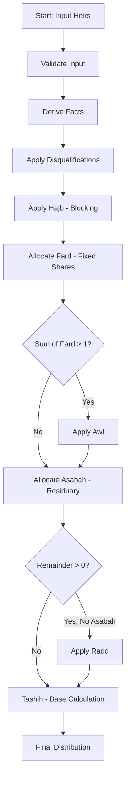

---

## Spouse Share Decision

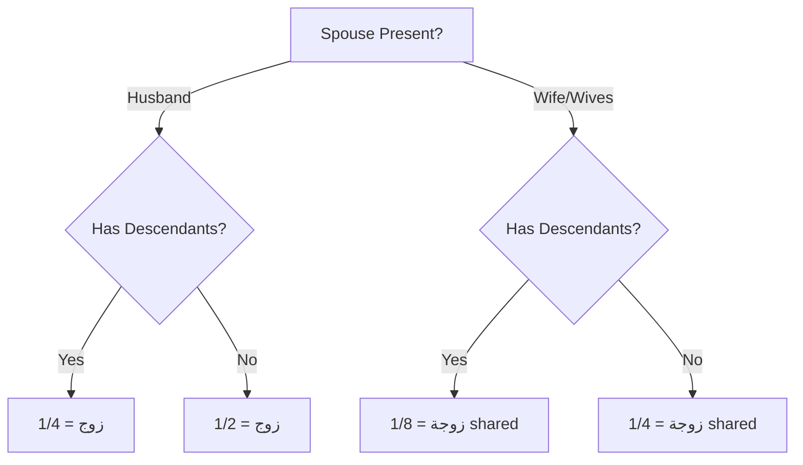

---

## Mother's Share Decision

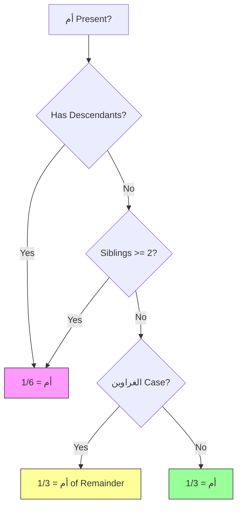

---

## Father's Share Decision

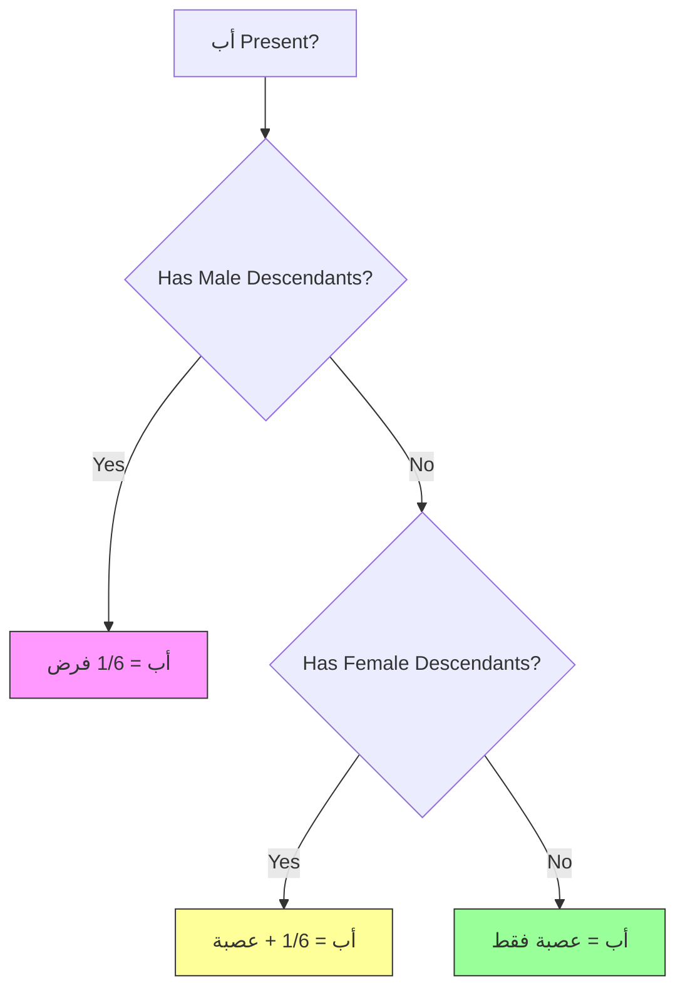

---

## Daughter(s) Share Decision

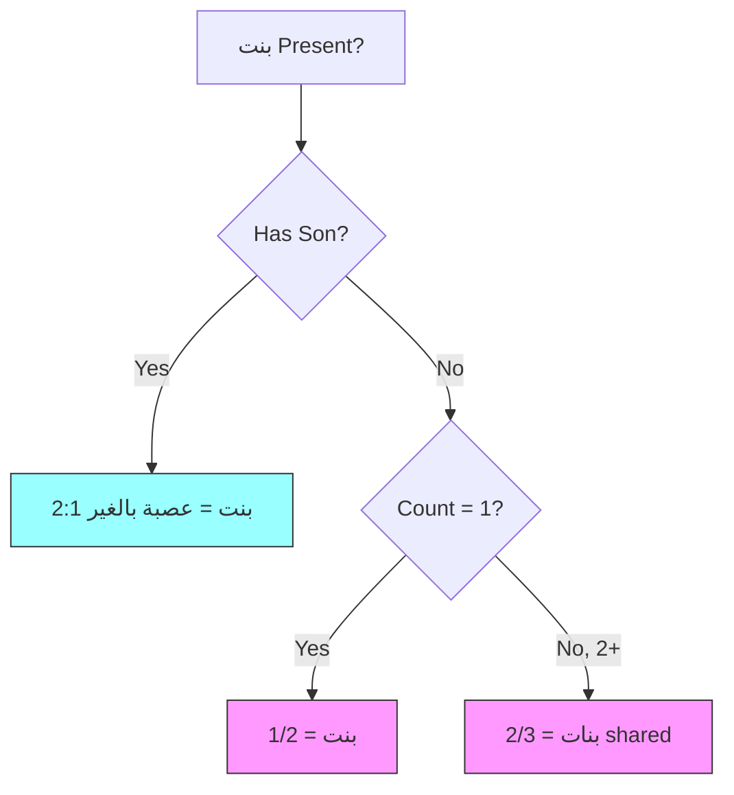

---

## Son's Daughter Share Decision

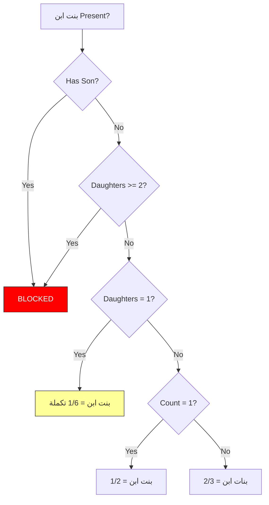

---

## Full Sister Share Decision

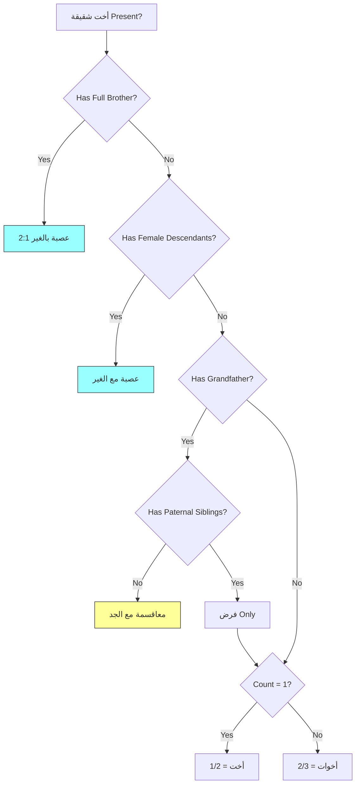

---

## Grandfather Best of Three (أحظ الثلاث)

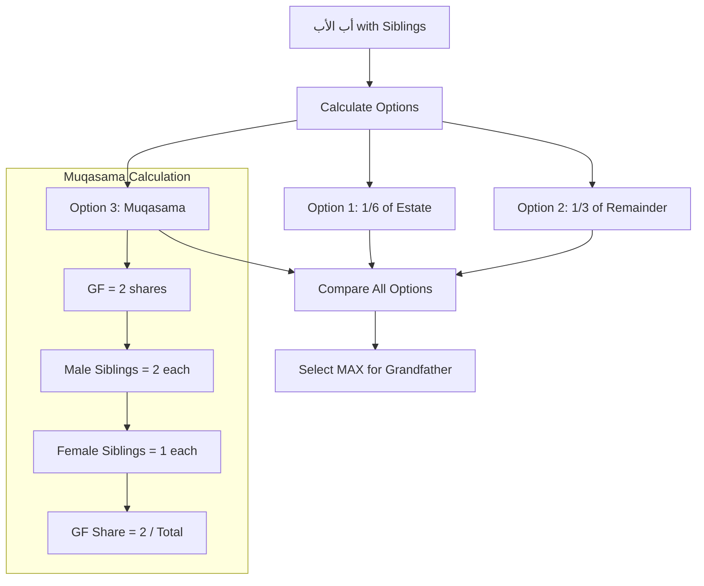

---

## Blocking Rules (الحجب) Hierarchy

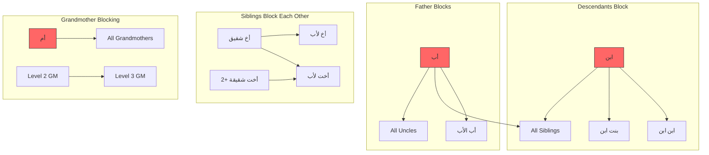

---

## Awl (العول) Cases

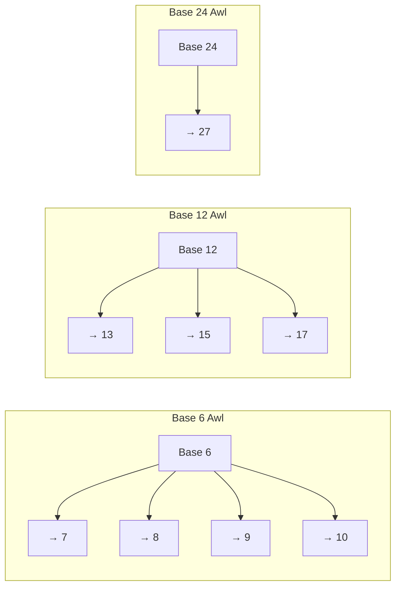

---

## Residuary (عصبة) Priority Chain

```mermaid
flowchart LR
    A["ابن"] --> B["ابن ابن"]
    B --> C["ابن ابن ابن"]
    C --> D["أب"]
    D --> E["أب الأب"]
    E --> F["أخ شقيق"]
    F --> G["أخ لأب"]
    G --> H["ابن أخ شقيق"]
    H --> I["ابن أخ لأب"]
    I --> J["عم شقيق"]
    J --> K["عم لأب"]
    K --> L["ابن عم شقيق"]
    L --> M["ابن عم لأب"]
    
    style A fill:#9f9,stroke:#333
    style D fill:#9f9,stroke:#333
    style F fill:#9f9,stroke:#333
```

---

## Complete Inheritance Decision Tree

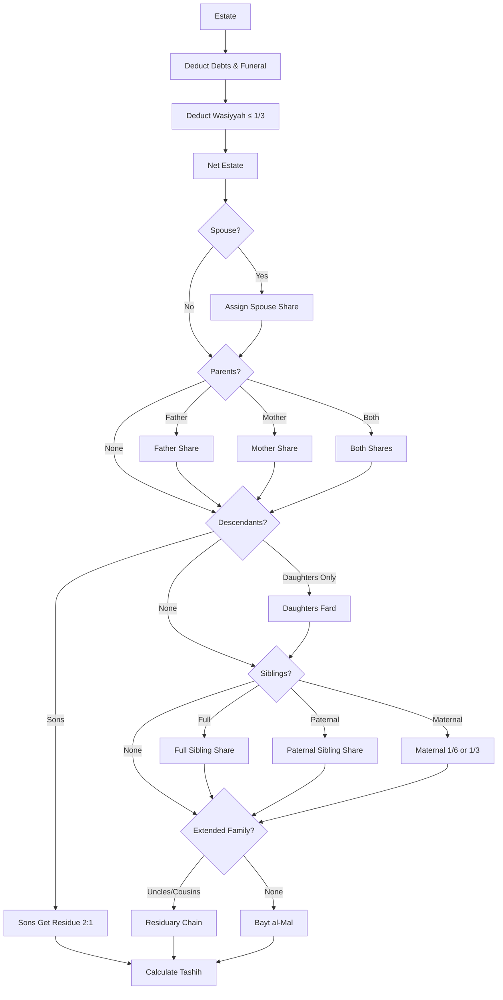

---

## Legend

| Color | Meaning |
|-------|---------|
| 🟩 Green | Residuary (عصبة) |
| 🟪 Pink | Fixed Share (فرض) |
| 🟨 Yellow | Special Case |
| 🟥 Red | Blocked (محجوب) |
| 🟦 Cyan | Asabah bi-ghayr |
